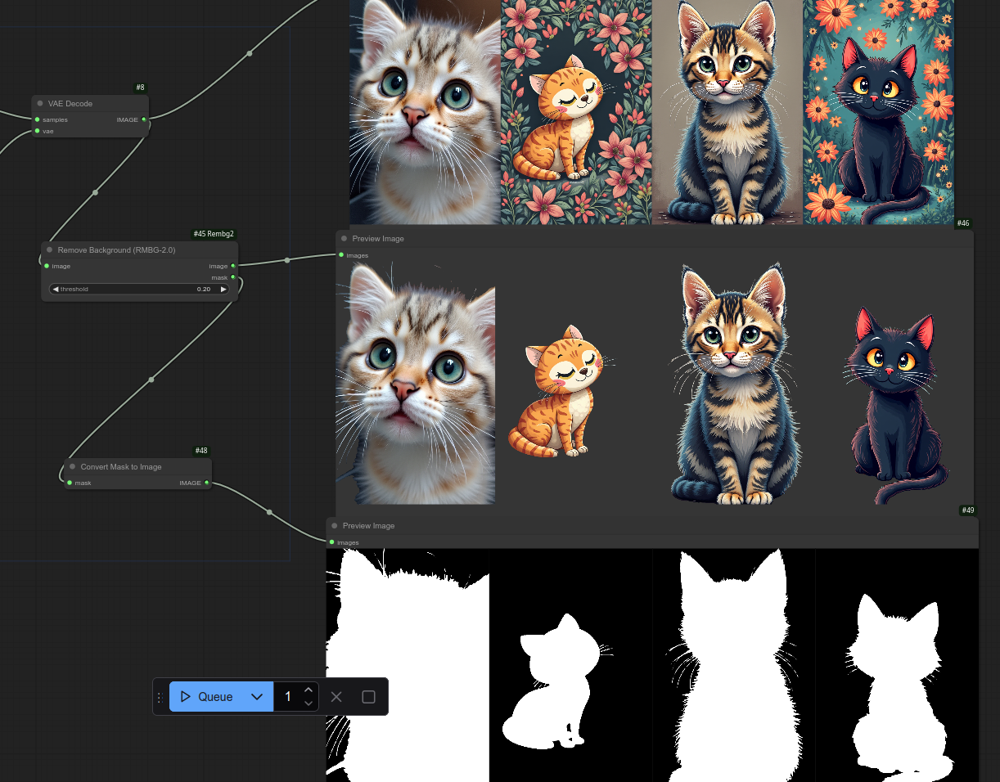

To use clone to custom_nodes.
Install requirements
`pip install -r requirements`

The node is called Remove Background (RMBG2.0) usage should be self explanatory. Enjoy.

(Model repo is here for reference: https://huggingface.co/briaai/RMBG-2.0)
